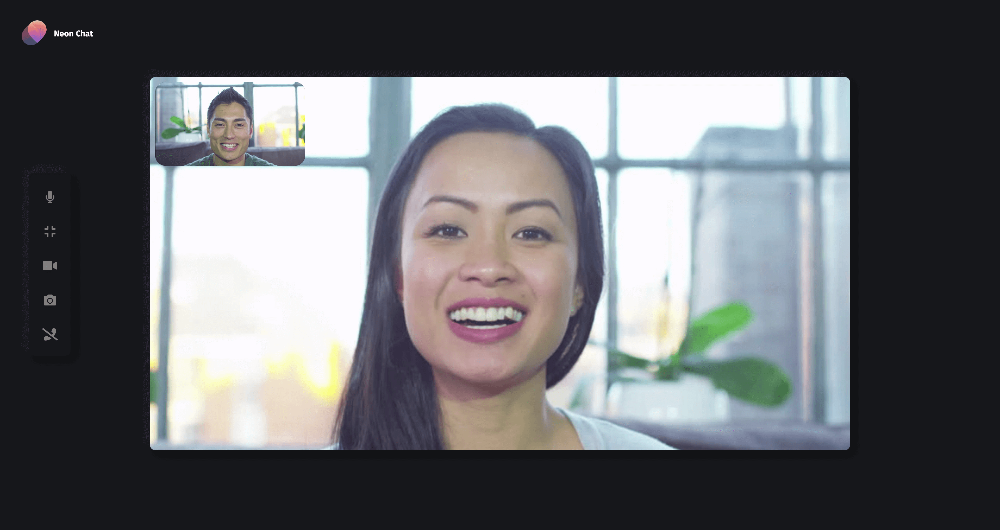

# Zipcall - Decentralized Video Chat

[](https://ianramzy.com)

[](https://paypal.me/ianramzy)

[](https://github.com/ianramzy/decentralized-video-chat)

# https://zipcall.io

Decentralized video chat platform powered by WebRTC using Twilio STUN/TURN infrastructure.
Zipcall provides video quality and latency simply not available with traditional
technology.

# Fixme




## Features

- Screen sharing
- Picture in picture
- Live captions
- Text chat
- Auto-scaling video quality
- No download required, entirely browser based
- Direct peer to peer connection ensures lowest latency
- Single use disposable chat rooms

## Quick start

- You will need to have Node.js installed, this project has been tested with Node version 10.X and 12.X
- Clone this repo

```
git clone https://github.com/ianramzy/decentralized-video-chat
cd decentralized-video-chat
```

- Install dependencies

```
npm install
```

- Start the server

```
npm start
```

- Open `localhost:3000` in Chrome or Firefox.
- If you want to use a client on another computer/network, make sure you publish your server on an HTTPS connection.
  You can use a service like [ngrok](https://ngrok.com/) for that.

## Quick Deployment

[](https://heroku.com/deploy?template=https://github.com/ianramzy/decentralized-video-chat)
